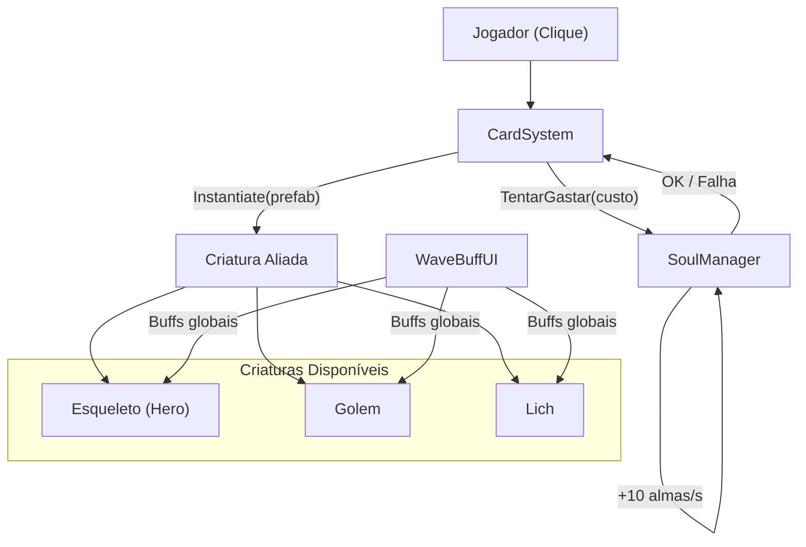
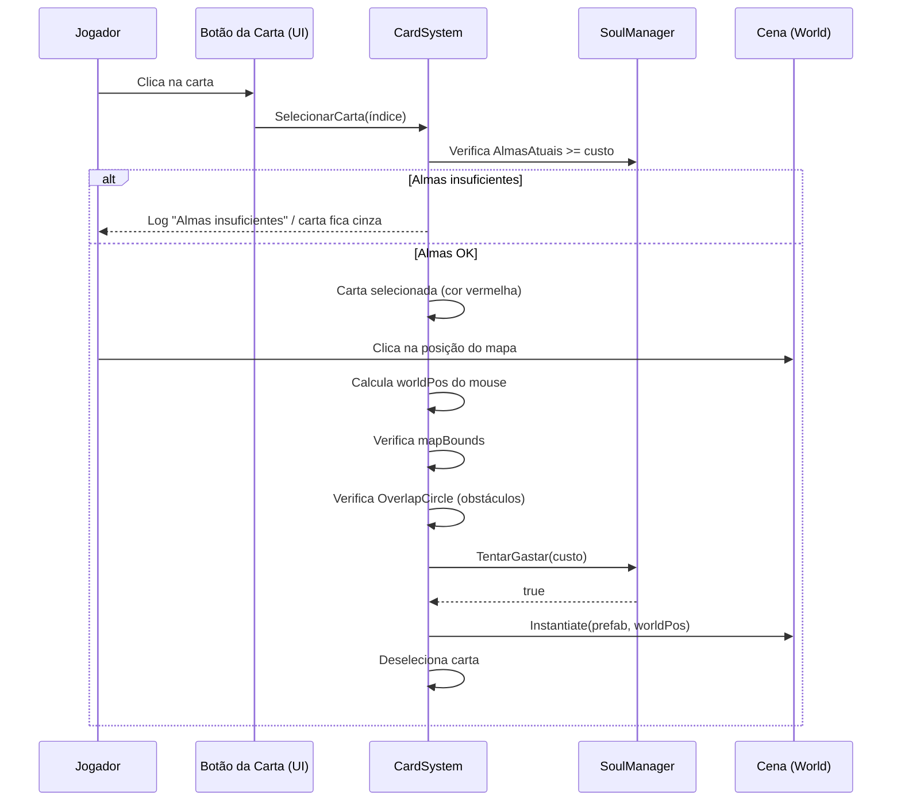
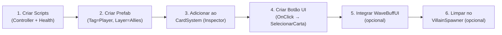

# PlayerControls — Sistema de Invocação (HollowCrown)

Guia completo do sistema de invocação de aliados. Cobre arquitetura, configuração na Unity e como adicionar novas criaturas.

---

## Índice

1. [Visão Geral da Arquitetura](#1-visão-geral-da-arquitetura)
2. [Fluxo de Invocação (Passo a Passo)](#2-fluxo-de-invocação-passo-a-passo)
3. [Configuração na Unity](#3-configuração-na-unity)
   - [SoulManager](#31-soulmanager)
   - [CardSystem](#32-cardsystem)
   - [Main Camera](#33-main-camera)
   - [MapBounds](#34-mapbounds)
   - [WaveBuffUI](#35-wavebuffui)
   - [Card Prefabs (UI)](#36-card-prefabs-ui)
   - [Creature Prefabs](#37-prefabs-das-criaturas)
4. [Pipeline: Adicionando uma Nova Criatura](#4-pipeline-adicionando-uma-nova-criatura)
5. [Referência: Scripts por Criatura](#5-referência-scripts-por-criatura)
6. [Troubleshooting](#6-troubleshooting)

---

## 1. Visão Geral da Arquitetura



### Scripts Envolvidos

| Script | Responsabilidade |
|---|---|
| `CardSystem.cs` | Sistema unificado de seleção e invocação de TODAS as criaturas |
| `SoulManager.cs` | Singleton. Gerencia almas (moeda), regeneração passiva e gasto |
| `WaveBuffUI.cs` | UI de buffs entre ondas — aplica modificadores globais aos aliados |
| `VillainSpawner.cs` | Spawna inimigos por onda, chama WaveBuffUI ao fim de cada onda |
| `PlayerLives.cs` | Singleton. Controla vidas do jogador (aliado morre → perde vida) |
| `CameraFollow.cs` | Segue o aliado com tag `"Player"` |

### Regras do Sistema

- **Sem limite de quantidade**: Não existe restrição de quantos aliados podem ser invocados simultaneamente.
- **Custo por alma**: Cada criatura tem seu próprio custo definido no Inspector. A invocação só é permitida se o jogador tiver almas suficientes.
- **Spawn seguro**: O sistema verifica obstáculos (`Physics2D.OverlapCircle`) e limites do mapa (`mapBounds Collider2D`) antes de permitir o spawn.

---

## 2. Fluxo de Invocação (Passo a Passo)



1. **Jogador clica em uma carta** → chama `CardSystem.SelecionarCarta(i)`.
2. **CardSystem verifica almas** → se insuficiente, não seleciona; se OK, destaca a carta em vermelho.
3. **Jogador clica no mapa** → CardSystem converte posição do mouse para world position.
4. **Verifica mapBounds** → se `mapBounds` collider está atribuído, verifica se o ponto está dentro.
5. **Verifica obstáculos** → `Physics2D.OverlapCircle` no ponto. Se há collider não-trigger, bloqueia.
6. **Gasta almas** → `SoulManager.TentarGastar(custo)`. Se falhar, cancela.
7. **Instantiate** → criatura é criada na posição. Carta é deselecionada.

---

## 3. Configuração na Unity

### 3.1 SoulManager

> [!IMPORTANT]
> O SoulManager **deve existir na cena antes de tudo**. Ele é um Singleton com `DontDestroyOnLoad`.

**Criar o GameObject:**

1. `GameObject → Create Empty` → renomeie para **"SoulManager"**
2. `Add Component → SoulManager`
3. Configure no Inspector:

| Campo | Valor Padrão | Descrição |
|---|---|---|
| `Almas Iniciais` | 50 | Almas no início de cada fase |
| `Regeneração Por Segundo` | 10 | Almas regeneradas passivamente por segundo |

> [!NOTE]
> O campo `custoInvocacao` antigo foi removido. Agora cada carta define seu próprio custo no CardSystem.

---

### 3.2 CardSystem

**Criar o GameObject:**

1. `GameObject → Create Empty` → renomeie para **"CardSystem"**
2. `Add Component → CardSystem`
3. No Inspector, configure:

| Campo | Descrição |
|---|---|
| `Cartas` | Array de cartas. Cada entrada é uma criatura invocável. |
| `Color Default` | Cor normal da carta (branco) |
| `Color Selected` | Cor quando selecionada (vermelho) |
| `Color Insuficiente` | Cor quando almas insuficientes (cinza semitransparente) |
| `Spawn Check Radius` | Raio para verificar obstáculos no ponto de spawn (0.5) |
| `Main Camera` | Referência à Main Camera (auto-detecta se vazio) |
| `Map Bounds` | Collider2D que define os limites do mapa (opcional) |

**Configurar cada Carta (elemento do array `Cartas`):**

| Campo | Exemplo (Esqueleto) | Exemplo (Golem) | Exemplo (Lich) |
|---|---|---|---|
| `Nome` | "Esqueleto" | "Golem" | "Lich" |
| `Prefab` | Prefab do Esqueleto | Prefab do Golem | Prefab do Lich |
| `Card Image` | Image do botão UI | Image do botão UI | Image do botão UI |
| `Custo Almas` | 30 | 80 | 120 |
| `Hotkey` | `Alpha1` | `Alpha2` | `Alpha3` |

---

### 3.3 Main Camera

1. Selecione a **Main Camera** na hierarquia
2. Certifique-se que tem a tag **"MainCamera"** (padrão do Unity)
3. `Add Component → CameraFollow` (se ainda não tiver)
4. Configure:
   - **Target**: Pode deixar vazio — o script busca automaticamente por `FindWithTag("Player")`
   - **Smooth Speed**: 5
   - **Offset**: (0, 0, -10)

> [!NOTE]
> Todos os aliados são criados com `tag = "Player"` (definido no Awake do HeroController/GolemController). A câmera seguirá o primeiro que encontrar.

---

### 3.4 MapBounds

O MapBounds é um **Collider2D** que delimita a área onde criaturas podem ser invocadas e inimigos podem spawnar.

**Configuração:**

1. `GameObject → Create Empty` → renomeie para **"MapBounds"**
2. `Add Component → BoxCollider2D` (ou PolygonCollider2D para mapas irregulares)
3. **Marque como Trigger**: `Is Trigger = ✓`
4. Redimensione para cobrir toda a área jogável do mapa
5. **Atribua no Inspector:**
   - Em **CardSystem** → campo `Map Bounds` → arraste o GameObject MapBounds
   - Em **VillainSpawner** → campo `Map Bounds` → arraste o mesmo GameObject

> [!WARNING]
> Se `Map Bounds` não estiver atribuído, o CardSystem permitirá invocação em qualquer posição visível. Sempre configure para evitar spawns fora do mapa!

---

### 3.5 WaveBuffUI

O WaveBuffUI aparece entre ondas para o jogador escolher um buff.

**Configuração:**

1. Dentro do **Canvas**, crie um painel:
   - `UI → Panel` → renomeie para **"BuffPanel"**
   - Dentro dele, crie 3 botões:
     - `UI → Button - TextMeshPro` → **"BuffButton1"**, **"BuffButton2"**, **"BuffButton3"**
2. Crie um `GameObject → Create Empty` (ou use o Canvas) → `Add Component → WaveBuffUI`
3. No Inspector:

| Campo | O que arrastar |
|---|---|
| `Buff Panel` | O GameObject "BuffPanel" |
| `Buff Buttons[0..2]` | Os 3 botões criados |
| `Buff Texts[0..2]` | Os componentes TextMeshProUGUI dentro de cada botão |
| `Buff Icons[0..2]` | (Opcional) Images dentro dos botões para ícones |

> [!TIP]
> O `BuffPanel` deve começar **desativado** (`SetActive(false)`). O WaveBuffUI ativa ele automaticamente ao fim de cada onda.

---

### 3.6 Card Prefabs (UI)

Os botões de carta ficam no **Canvas** e são conectados ao CardSystem.

**Para cada carta (Esqueleto, Golem, Lich):**

1. Dentro do Canvas, crie `UI → Button - TextMeshPro`
2. Renomeie para **"Card_Esqueleto"**, **"Card_Golem"**, **"Card_Lich"**
3. (Opcional) Adicione uma imagem de fundo no componente `Image` do botão
4. No componente **Button → On Click()**:
   - Arraste o GameObject que tem o **CardSystem**
   - Selecione `CardSystem → SelecionarCarta`
   - Passe o **índice** da carta:
     - Esqueleto = `0`
     - Golem = `1`
     - Lich = `2`
5. No CardSystem Inspector → `Cartas[i].Card Image` → arraste o componente **Image** do botão correspondente

```
Canvas
├── Card_Esqueleto   (Button → OnClick → CardSystem.SelecionarCarta(0))
├── Card_Golem       (Button → OnClick → CardSystem.SelecionarCarta(1))
├── Card_Lich        (Button → OnClick → CardSystem.SelecionarCarta(2))
├── BuffPanel (desativado por padrão)
│   ├── BuffButton1
│   ├── BuffButton2
│   └── BuffButton3
└── GridDeVida (vidas do jogador)
```

---

### 3.7 Prefabs das Criaturas

Cada criatura aliada é um **Prefab** independente com seus próprios scripts de comportamento.

#### Esqueleto (Hero)

| Componente | Configuração |
|---|---|
| `SpriteRenderer` | Sprite do esqueleto |
| `Rigidbody2D` | Gravity Scale = 0, Freeze Rotation Z = ✓ |
| `BoxCollider2D` | Tamanho adequado ao sprite |
| `HeroController` | moveSpeed=5, attackRange=6, stopDistance=0.8 |
| `HeroHealth` | maxHealth=100, attackDamage=10, attackRange=1.5, attackCooldown=1 |
| `HeroAnimator` | (se tiver animações) |
| **Tag** | `Player` (definido automaticamente pelo HeroController.Awake) |
| **Layer** | `Allies` |

#### Golem

| Componente | Configuração |
|---|---|
| `SpriteRenderer` | Sprite do golem |
| `Rigidbody2D` | Gravity Scale = 0, Freeze Rotation Z = ✓ |
| `BoxCollider2D` | Tamanho adequado |
| `GolemController` | moveSpeed=2.5, attackRange=6, stopDistance=1.2 |
| `GolemHealth` | maxHealth=250, attackDamage=15, aoeRadius=2.5, attackCooldown=1.5 |
| `GolemAnimator` | (se tiver animações) |
| **Tag** | `Player` (definido automaticamente pelo GolemController.Awake) |
| **Layer** | `Allies` |

#### Lich

| Componente | Configuração |
|---|---|
| `SpriteRenderer` | Sprite do lich |
| `Rigidbody2D` | Gravity Scale = 0, Freeze Rotation Z = ✓ |
| `BoxCollider2D` | Tamanho adequado |
| `LichAttack` | attackRange=10, fireRate=1, damage=20, moveSpeed=1.5, followDistance=3 |
| `LichHealth` | maxHealth=80 |
| `LichAnimator` | (se tiver animações) |
| **Filhos** | `FirePoint` (Transform vazio na posição de disparo) |
| **Tag** | `Player` (atribuir manualmente no Prefab) |
| **Layer** | `Allies` |

> [!IMPORTANT]
> O LichAttack e LichHealth usam `FindWithTag("Player")` para seguir o primeiro aliado. Certifique-se de que pelo menos um aliado tenha a tag `Player`.

---

## 4. Pipeline: Adicionando uma Nova Criatura

Siga estes passos para adicionar uma nova criatura invocável (exemplo: **"Dragão"**).

### Passo 1 — Criar os Scripts da Criatura

Crie os scripts necessários na pasta `Assets/Scripts/`:

```
DragonController.cs   → IA de movimento (perseguir inimigos, anti-softlock)
DragonHealth.cs       → Vida, ataque, morte
DragonAnimator.cs     → (Opcional) animações
```

**DragonController.cs** — use HeroController ou GolemController como base:
- `RequireComponent(typeof(Rigidbody2D))`
- No `Awake()`: configure `rb.gravityScale = 0`, `rb.freezeRotation = true`, `gameObject.tag = "Player"`
- Busque inimigos via `VillainHealth.All`
- Inclua sistema anti-softlock (copie do HeroController)

**DragonHealth.cs** — use HeroHealth ou GolemHealth como base:
- Campos: `maxHealth`, `currentHealth`, `attackDamage`, `attackCooldown`
- `TakeDamage(float)`: reduz vida, chama `PlayerLives.PerderVida()` na morte
- `TryAttack()`: itera sobre `VillainHealth.All` para atacar

### Passo 2 — Criar o Prefab

1. Na Hierarchy: `GameObject → Create Empty` → renomeie para **"Dragon"**
2. Adicione os componentes:
   - `SpriteRenderer` → atribua o sprite
   - `Rigidbody2D` → Gravity Scale = 0, Freeze Rotation Z = ✓
   - `BoxCollider2D` → ajuste tamanho
   - `DragonController`
   - `DragonHealth`
   - `DragonAnimator` (se tiver)
3. **Tag** = `Player`, **Layer** = `Allies`
4. Arraste da Hierarchy para `Assets/Prefabs/` para criar o Prefab
5. Delete a instância da Hierarchy

### Passo 3 — Adicionar ao CardSystem

1. Selecione o GameObject **CardSystem** no Inspector
2. No array `Cartas`, aumente o tamanho em +1
3. Preencha a nova entrada:
   - **Nome**: "Dragão"
   - **Prefab**: arraste o prefab Dragon
   - **Card Image**: arraste a Image do botão UI
   - **Custo Almas**: defina o custo (ex: 150)
   - **Hotkey**: (opcional) `Alpha4`

### Passo 4 — Criar o Botão UI

1. No Canvas, crie `UI → Button - TextMeshPro` → **"Card_Dragon"**
2. Configure o `OnClick`:
   - Arraste o CardSystem
   - Função: `CardSystem.SelecionarCarta`
   - Parâmetro: o índice da nova carta (ex: `3`)
3. No CardSystem Inspector, atribua a Image deste botão ao `Card Image` da nova carta

### Passo 5 — Integrar com WaveBuffUI (Opcional)

Se quiser que os buffs de onda afetem a nova criatura:

1. Abra `WaveBuffUI.cs`
2. No método `AplicarBuffsAosAliadosExistentes()`, adicione:

```csharp
// Dragão
foreach (DragonHealth dragon in FindObjectsByType<DragonHealth>(FindObjectsSortMode.None))
{
    if (dragon == null || !dragon.gameObject.activeInHierarchy) continue;
    DragonController dc = dragon.GetComponent<DragonController>();

    dragon.attackDamage = (dragon.attackDamage + bonusDamage) * multDamage;
    dragon.maxHealth = (dragon.maxHealth + bonusHealth) * multHealth;
    if (dragon.currentHealth > dragon.maxHealth) dragon.currentHealth = dragon.maxHealth;
    if (dc != null) dc.moveSpeed = (dc.moveSpeed + bonusSpeed) * multSpeed;
    if (bonusAttackSpeed > 0f) dragon.attackCooldown *= (1f - bonusAttackSpeed);
}
```

3. No método `CurarTodosAliados()`, adicione:

```csharp
foreach (DragonHealth dragon in FindObjectsByType<DragonHealth>(FindObjectsSortMode.None))
{
    if (dragon != null && dragon.gameObject.activeInHierarchy)
        dragon.currentHealth = Mathf.Min(dragon.maxHealth, dragon.currentHealth + dragon.maxHealth * percentual);
}
```

### Passo 6 — Limpeza no VillainSpawner (Opcional)

Se quiser que aliados sejam destruídos ao trocar de fase:

```csharp
// Em VillainSpawner.FinalizarJogo():
foreach (var v in Object.FindObjectsByType<DragonHealth>())
    if (v != null) Destroy(v.gameObject);
```

### Resumo da Pipeline



---

## 5. Referência: Scripts por Criatura

### Criaturas Aliadas (Invocáveis pelo CardSystem)

| Criatura | Controller | Health | Animator | Ataque | Tipo |
|---|---|---|---|---|---|
| **Esqueleto** | `HeroController` | `HeroHealth` | `HeroAnimator` | Melee (corpo a corpo) | Melee DPS |
| **Golem** | `GolemController` | `GolemHealth` | `GolemAnimator` | AoE (dano em área) | Tank AoE |
| **Lich** | `LichAttack` | `LichHealth` | `LichAnimator` | Ranged (projétil) | Ranged Caster |

### Scripts de Apoio

| Script | Função |
|---|---|
| `SoulManager` | Economia de almas (singleton, DontDestroyOnLoad) |
| `CardSystem` | Interface de invocação unificada |
| `WaveBuffUI` | Buffs entre ondas |
| `PlayerLives` | Vidas do jogador (aliado morre → perde vida) |
| `CameraFollow` | Câmera segue aliado com tag Player |
| `VillainSpawner` | Spawna inimigos, gerencia ondas |

### Layers Recomendadas

| Layer | Uso |
|---|---|
| `Allies` | Todos os aliados (Esqueleto, Golem, Lich) |
| `Enemies` | Todos os inimigos (Villain, Mage inimigo) |
| `Obstacles` | Obstáculos do mapa (paredes, pedras, etc.) |

---

## 6. Troubleshooting

### "Almas insuficientes" mas eu tenho almas

- Verifique se o `SoulManager` existe na cena (busque na Hierarchy).
- Verifique se o custo no `CardSystem → Cartas[i].Custo Almas` está correto.
- Verifique se o `SoulManager.ResetarParaFase()` não está sendo chamado no momento errado.

### Carta fica cinza e não seleciona

- A cor cinza indica almas insuficientes. Espere a regeneração passiva.
- Verifique `SoulManager → Regeneração Por Segundo`.

### Criatura spawna mas não se move

- Certifique-se que o Prefab tem `Rigidbody2D` com `Gravity Scale = 0`.
- Verifique se o Controller (HeroController/GolemController/LichAttack) está no Prefab.
- Verifique se há inimigos na cena (o aliado só se move quando detecta inimigos via `VillainHealth.All`).

### "Local bloqueado por..."

- Há um collider não-trigger na posição do clique.
- Tente clicar em um local livre de obstáculos.
- Ajuste `Spawn Check Radius` para um valor menor se necessário.

### Câmera não segue o aliado

- Verifique se o aliado tem tag `Player` (atribuída automaticamente no Awake do Controller).
- Verifique se `CameraFollow` está na Main Camera.

### Aliado não recebe buffs do WaveBuffUI

- O buff é aplicado aos aliados **existentes** no momento da escolha.
- Aliados invocados depois já nascem sem buff acumulado.
- Para novos tipos de criatura, adicione-os manualmente em `AplicarBuffsAosAliadosExistentes()` e `CurarTodosAliados()`.

### Spawn fora do mapa

- Configure o `Map Bounds` (Collider2D com Is Trigger ✓) e atribua no CardSystem e VillainSpawner.
